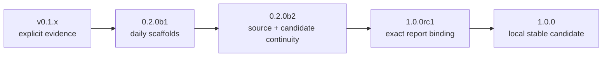

# Update map

Requirement Ledger v1.0.0 is a **local stable candidate**. This map records the completed local
release train and separates it from external publication: no tag, push, GitHub Release, public CI
result, marketplace submission, or adoption claim is implied.

[中文更新地图](UPDATE_MAP.zh-CN.md) · [stable contract](docs/V1_STABLE_CONTRACT.md) ·
[roadmap](ROADMAP.md)



## Completed local train

| Candidate | Real increment | Local status |
| --- | --- | --- |
| `0.2.0b1` | Installed `audit`/`daily`/`weekly` review scaffolds and explicit timezone/window handling. | Completed and locally verified. |
| `0.2.0b2` | Path-free source packs, explicit source re-verification, and candidate continuity without semantic guessing. | Completed and locally verified. |
| `1.0.0rc1` | Exact final-report binding plus read-only handoff re-validation. | Completed and locally verified. |
| `1.0.0` | Stable contract, core/plugin separation, release documentation, and full local qualification. | Local stable candidate; external publication remains separate. |

The earlier v0.1 explicit-input commands remain compatible. Earlier Alpha work established bounded
Codex-input handling; it does not grant automatic history discovery or broaden v1 sources.

## Stable product surface

The fixed v1 workflow is:

```text
review-init / review-check
  -> source-pack / source-verify
  -> candidate-sync
  -> final report
  -> review-bind
  -> review-handoff-check
```

`audit`, `daily`, and `weekly` all require a host/user-selected target, window where applicable,
scope root, and source files. A successful handoff check is only an identity check: it shows that
the current report bytes, candidate state, and explicit sources match the binding. It does not
prove correctness, approval, ownership, or authority to execute an action.

The Codex layer is a repo-local skills-only plugin at `.agents/plugins/marketplace.json` and
`plugins/requirement-ledger`. It guides an already-installed CLI; it does not contain a duplicate
runtime, MCP service, app, hooks, plugin-owned authentication implementation or credential flow,
or updater. Its required `ON_INSTALL` marketplace policy is Codex host metadata.

## Local qualification vs. public release

The stable candidate is qualified only when the local source tests, build/install smokes, command
workflows, plugin structure/installation checks, and documentation/contract review agree for this
checkout. These are maintainer-controlled checks, not a claim of hosted CI or external use.

Before any public release, a maintainer must separately decide to commit/tag/push, publish assets,
verify the exact public artefacts, and satisfy the then-current Codex marketplace/submission
requirements. None of those actions are performed by the CLI or implied by this file.

## Future `1.x`

- `1.0.x`: only evidence-backed compatibility, privacy, parser, packaging, or documentation fixes.
- `1.1`: opt-in integrations only after their input boundary, consent, retention, and failure
  modes are specified and independently tested.
- Later: additional providers or higher-level UX only when they preserve explicit source selection,
  private evidence, and non-authorising verification.

There is no scheduled version churn. A new release needs a real, tested change and a separately
authorised publication decision.
