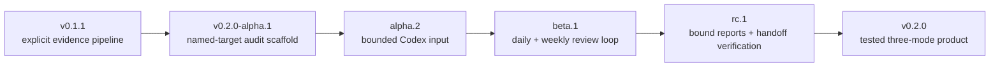

# Update map

Requirement Ledger is being completed as a usable `v0.2.0` product in a ten-day, gate-driven
sprint. A day is a review target, not permission to publish unfinished work. Every public version
must have a coherent capability, passing tests, accurate notes, and a clean privacy review.

[中文更新地图](UPDATE_MAP.zh-CN.md) · [roadmap](ROADMAP.md) ·
[v0.2.0-alpha.1 notes](docs/release-notes/v0.2.0-alpha.1.md)

## Where this Alpha sits

`v0.2.0-alpha.1` is the first installable bridge between the released v0.1 evidence engine and
the Codex-first product. It can initialise and mechanically validate one private, named-target
audit. It does **not** retrieve the target history or make a semantic diagnosis by itself.

## Problem-to-capability map

| User problem | Alpha 1 response | State |
| --- | --- | --- |
| “I can name the Skill or project, but I do not know how to structure the review.” | `review-init --mode audit` creates a bounded, private scaffold with explicit target, window, timezone, coverage, and unknowns. | Shipped in Alpha 1 |
| “A report can look complete while required evidence or safety fields are missing.” | `review-check` validates the report contract, sections, evidence labels, candidate state, authorisation declaration, and time window. | Shipped in Alpha 1 |
| “A generated review might overwrite work or expose a broadly readable private file.” | New scaffolds use restrictive permissions where supported and fail instead of overwriting an existing path. | Shipped in Alpha 1 |
| “I want Codex to find only related history without making me retell everything.” | Add a bounded Codex input adapter with honest coverage and exclusion records. | Next Alpha gate |
| “I want yesterday and the last week reviewed without repeating old suggestions.” | Add real daily/weekly initialisation, stable candidate carry-over, and deduplication. | Beta gate |
| “I need proof that the final report is the same file that was approved and handed off.” | Bind exact report bytes and revalidate immediately before handoff. | Release-candidate gate |

## Ten-day completion sprint

| Target day | Candidate or milestone | Only exits when |
| --- | --- | --- |
| 1 | `v0.2.0-alpha.1` | Public prerelease assets install cleanly; named-audit scaffold and checker pass; notes and checksums match the uploaded files. |
| 2 | Public replay + second real named-Skill case | A maintainer-selected case records included/excluded sources, one preserved behaviour, one useful change card, one success case, and one boundary case. |
| 3 | `v0.2.0-alpha.2` target | Bounded Codex export input has explicit selection, no unrelated-history scan, honest partial coverage, and regression tests. |
| 4 | Daily/weekly implementation gate | Yesterday/week windows, timezone handling, source provenance, and analysis-only authorisation are mechanically testable. |
| 5 | `v0.2.0-beta.1` target | Audit, daily, and weekly can be initialised from the installed package; carry-over IDs prevent duplicate recommendations. |
| 6 | Report binding gate | Review packs bind target, sources, candidate state, and exact report bytes without copying private source text into share-facing output. |
| 7 | `v0.2.0-rc.1` target | The approved report is revalidated immediately before Codex handoff; mismatch and stale-report cases fail closed. |
| 8 | Portability and privacy hardening | Linux, macOS, and Windows CI pass; wheel/sdist, clean install, permissions, path safety, and privacy canaries pass. |
| 9 | `v0.2.0-rc.2` target | One-time, daily, and weekly synthetic demos plus maintainer-owned evidence agree with the docs and package. |
| 10 | `v0.2.0` decision | Release only if every v0.2 promise passes on the same commit; otherwise publish the failed gate and continue with the existing prerelease. |

Candidate names are targets, not a promise to create activity. No empty release, backdating, or
automatic daily publishing is part of this plan.

### Release gates

Every public candidate must pass the same minimum gate:

1. full source tests and bilingual-document sync;
2. wheel and sdist built from the tagged source;
3. clean installation and command-level smoke tests for both artefacts;
4. deterministic synthetic outputs and fail-closed privacy/path checks;
5. a reviewed diff, accurate limitations, relative checksums, and a public CI result;
6. a current maintainer decision to publish that exact commit.

## What “complete in ten days” means

The target is a stable, useful `v0.2.0`: one repository and installable package supporting a
traceable one-time, daily, and weekly Codex review workflow, with visible authorisation before any
edit and reproducible handoff evidence afterward. It does not mean that all future integrations or
every personal workflow are finished.

## Explicitly outside this sprint

- unattended edits, commits, pushes, Issues, PRs, Releases, uploads, or account actions;
- silent discovery of a home directory or unrelated Codex history;
- a hosted dashboard, telemetry, or an external-user adoption claim without evidence;
- claiming that pattern-based privacy checks make a report safe to publish without human review.
