# Update map

Requirement Ledger is being completed as a usable `v0.2.0` product through a ten-day public
release train. One substantive candidate is targeted for each day; a failed gate shifts that
candidate and every dependent target instead of creating an empty release. Every public version
must have a coherent capability, passing tests, accurate notes, and a clean privacy review.

[中文更新地图](UPDATE_MAP.zh-CN.md) · [roadmap](ROADMAP.md) ·
[v0.2.0-alpha.1 notes](docs/release-notes/v0.2.0-alpha.1.md)

## Where this Alpha sits

```mermaid
flowchart LR
    A["v0.1.1<br/>explicit evidence pipeline"] --> B["v0.2.0-alpha.1<br/>named-target audit scaffold"]
    B --> C["alpha.2<br/>bounded Codex input"]
    C --> D["alpha.3<br/>real-case improvement proof"]
    D --> E["beta.1<br/>installed daily review"]
    E --> F["beta.2<br/>installed weekly review"]
    F --> G["beta.3<br/>candidate carry-over + dedupe"]
    G --> H["rc.1<br/>exact-byte report binding"]
    H --> I["rc.2<br/>pre-handoff revalidation"]
    I --> J["rc.3<br/>three-mode launch qualification"]
    J --> K["v0.2.0<br/>tested three-mode product"]
```

`v0.2.0-alpha.1` is the first installable bridge between the released v0.1 evidence engine and
the Codex-first product. It can initialise and mechanically validate one private, named-target
audit. It does **not** retrieve the target history or make a semantic diagnosis by itself.

## Problem-to-capability map

| User problem | Product response | State |
| --- | --- | --- |
| “I can name the Skill or project, but I do not know how to structure the review.” | `review-init --mode audit` creates a bounded, private scaffold with explicit target, window, timezone, coverage, and unknowns. | Shipped in Alpha 1 |
| “A report can look complete while required evidence or safety fields are missing.” | `review-check` validates the report contract, sections, evidence labels, candidate state, authorisation declaration, and time window. | Shipped in Alpha 1 |
| “A generated review might overwrite work or expose a broadly readable private file.” | New scaffolds use restrictive permissions where supported and fail instead of overwriting an existing path. | Shipped in Alpha 1 |
| “I want Codex to use related history without making me retell everything.” | Alpha 2 accepts one explicit bounded input envelope; Alpha 3 normalises supported Codex exports and records structured exclusions. | Alpha 2/3 gates |
| “I want yesterday and the last week reviewed without repeating old suggestions.” | Beta 1 installs daily review, Beta 2 installs weekly review, and Beta 3 carries stable candidates forward with deduplication. | Beta 1/2/3 gates |
| “I need proof that the final report is the same file that was checked and handed off.” | RC 1 binds exact report bytes; RC 2 revalidates them immediately before handoff; RC 3 qualifies the complete three-mode surface. | RC 1/2/3 gates |

## Ten-day completion sprint

Git tags use the names below; Python packages map respectively to `0.2.0a1`, `0.2.0a2`,
`0.2.0a3`, `0.2.0b1`, `0.2.0b2`, `0.2.0b3`, `0.2.0rc1`, `0.2.0rc2`,
`0.2.0rc3`, and `0.2.0`. Every candidate before stable is a prerelease.

| Target day | Public candidate | One substantive increment and exit gate |
| --- | --- | --- |
| 1 | `v0.2.0-alpha.1` | **Published.** Private named-audit scaffold, strict checker, clean wheel/sdist installs, matching notes/checksums, and cross-platform CI. |
| 2 | `v0.2.0-alpha.2` | Add one explicit bounded input envelope with source identity/digest, target/window, included/excluded records, and honest coverage; reject directory, home, symlink-boundary, changing, and oversized inputs. |
| 3 | `v0.2.0-alpha.3` | Normalise supported modern Codex exports with ordered completed items, snapshot dedupe, half-open windows, and structured automation/delegation exclusions; prove it with fixtures and one real named-Skill review. |
| 4 | `v0.2.0-beta.1` | Ship installed daily initialisation/checking with an exact yesterday window, IANA timezone, source provenance, and analysis-only authority. |
| 5 | `v0.2.0-beta.2` | Ship installed weekly initialisation/checking with an exact week window and source-bound GitHub/ecosystem evidence; no unbounded trend scrape. |
| 6 | `v0.2.0-beta.3` | Carry stable candidate IDs across audit/daily/weekly runs; unresolved findings continue and repeated recommendations deduplicate without silent loss. |
| 7 | `v0.2.0-rc.1` | Bind target, sources, candidate state, and exact report bytes at review-pack creation; one-byte, metadata, or target drift fails, while share-facing output contains no private path or source text. |
| 8 | `v0.2.0-rc.2` | Re-read and revalidate the approved report immediately before handoff without mutating it; stale, mismatch, changed-target, and unsafe-file cases fail closed. |
| 9 | `v0.2.0-rc.3` | Freeze deterministic one-time/daily/weekly demos, maintainer-owned cases, package/docs/limitations, and full Python 3.10–3.13 × Linux/macOS/Windows qualification on one commit. |
| 10 | `v0.2.0` | Promote only the unchanged RC evidence when every v0.2 promise passes on the same commit; otherwise retain RC 3, publish the failed gate, and shift the stable date. |

`Day N` means the Nth successful release day. Under a no-slip schedule starting with Alpha 1 on
2026-08-30 (Asia/Shanghai), the stable target is 2026-09-08; any failed gate shifts that date and
every dependent candidate. Dates never permit backdating or a no-change release.

### Release gates

Every public candidate must pass the same minimum gate:

1. full source tests and bilingual-document sync;
2. wheel and sdist built from the tagged source;
3. clean installation and command-level smoke tests for both artefacts;
4. deterministic synthetic outputs and fail-closed privacy/path checks;
5. a reviewed diff, accurate limitations, relative checksums, and a public CI result;
6. coherent Git tag and Python package versions, with CI tied to the exact tagged commit;
7. candidate-specific fixtures or a maintainer-owned case proving the new increment;
8. a current maintainer decision for that exact commit, followed by public asset re-download and
   checksum/installation smoke.

## Maintenance after `v0.2.0`

- Run one real maintenance cycle every 5–10 days: review user evidence, reproduce findings, update
  tests/docs/code where justified, and re-run the release gate.
- Publish a compatible `0.2.x` patch only when that cycle produces a real bug, privacy,
  compatibility, packaging, or documentation fix. A healthy no-change review creates no tag.
- Security or data-exposure findings override the cadence and are handled immediately.
- New incompatible promises wait for the next minor line; the patch train does not smuggle in
  unfinished `v0.3` work.

## What “complete in ten days” means

The target is a stable, useful `v0.2.0`: one repository and installable package supporting a
traceable one-time, daily, and weekly Codex review workflow, with visible authorisation before any
edit and reproducible handoff evidence afterward. It does not mean that all future integrations or
every personal workflow are finished. At least one maintainer-owned audit, daily, and weekly case
must pass the complete installed path; those cases do not prove external-user adoption.

## Explicitly outside this sprint

- unattended edits, commits, pushes, Issues, PRs, Releases, uploads, or account actions;
- silent discovery of a home directory or unrelated Codex history;
- a hosted dashboard, telemetry, or an external-user adoption claim without evidence;
- claiming that pattern-based privacy checks make a report safe to publish without human review;
- claiming that a digest proves authorship, truth, approval, or implementation authority;
- creating an automatic schedule merely because daily/weekly modes are installed;
- treating CI, synthetic demos, or maintainer-owned cases as proof of general adoption.
