<!-- translation-of: UPDATE_MAP.md sha256:0c6428fe2e431a92 -->

# 更新地图

Requirement Ledger 将用十天公开发布列车完善成可用的 `v0.2.0` 产品。每天目标是推出一个有
真实增量的候选版；任一门禁失败，就顺延该版本及后续依赖目标，而不是发布空版本。每个公开版本都
必须能力完整、测试通过、说明准确，并通过隐私复核。

[English](UPDATE_MAP.md) · [路线图](ROADMAP.zh-CN.md) ·
[v0.2.0-alpha.3 发布说明](docs/release-notes/v0.2.0-alpha.3.zh-CN.md)

## 这个 Alpha 位于哪里

```mermaid
flowchart LR
    A["v0.1.1<br/>显式证据管线"] --> B["v0.2.0-alpha.1<br/>点名目标审查骨架"]
    B --> C["alpha.2<br/>有界 Codex 输入"]
    C --> D["alpha.3<br/>真实案例改进证据"]
    D --> E["beta.1<br/>安装版日报"]
    E --> F["beta.2<br/>安装版周报"]
    F --> G["beta.3<br/>候选延续 + 去重"]
    G --> H["rc.1<br/>报告精确字节绑定"]
    H --> I["rc.2<br/>交接前立即复验"]
    I --> J["rc.3<br/>三模式发布资格"]
    J --> K["v0.2.0<br/>通过测试的三模式产品"]
```

公开的 `v0.2.0-alpha.1` 是第一个可安装的点名目标审查桥梁。Alpha 2 新增严格 `codex-scan`
边界，只处理一份选中导出；`v0.2.0-alpha.3` 继续加入受支持的现代 rollout 归一化、完成项目顺序、
快照去重和结构化语义排除。它**不会**发现目标历史，也不会声称一份选中导出就是完整历史。

## 问题到能力的映射

| 用户问题 | 产品回应 | 状态 |
| --- | --- | --- |
| “我能点名 Skill 或项目，但不知道审查结构该怎么写。” | `review-init --mode audit` 生成有明确目标、窗口、时区、覆盖与未知项的私有审查骨架。 | Alpha 1 已交付 |
| “报告看着完整，但可能缺少必要证据或安全字段。” | `review-check` 校验报告契约、章节、证据标签、候选状态、授权声明和时间窗口。 | Alpha 1 已交付 |
| “生成审查可能覆盖已有内容，或让私有文件权限过宽。” | 在支持的平台上，新骨架使用严格权限；输出路径已存在时直接失败。 | Alpha 1 已交付 |
| “我希望 Codex 使用相关历史，不要让我重新讲一遍。” | Alpha 2 绑定一份显式导出并内嵌有界输入信封；Alpha 3 归一化支持的现代 Codex 事件并记录语义排除项。 | Alpha 2 和 Alpha 3 均已交付 |
| “我想复盘昨天和过去一周，又不想重复旧建议。” | Beta 1 交付日报，Beta 2 交付周报，Beta 3 用稳定候选延续和去重。 | Beta 1／2／3 门禁 |
| “我需要证明最终交接的是经过检查的同一份报告。” | RC 1 绑定报告精确字节，RC 2 在交接前立即复验，RC 3 验收完整三模式表面。 | RC 1／2／3 门禁 |

## 十天完善冲刺

下表使用 Git Tag 名称；对应 Python 包版本依次为 `0.2.0a1`、`0.2.0a2`、`0.2.0a3`、
`0.2.0b1`、`0.2.0b2`、`0.2.0b3`、`0.2.0rc1`、`0.2.0rc2`、`0.2.0rc3`
和 `0.2.0`。稳定版之前的每个候选均为 prerelease。

| 目标日 | 公开候选版 | 唯一真实增量与退出门 |
| --- | --- | --- |
| 第 1 天 | `v0.2.0-alpha.1` | **已发布。** 私有点名审查骨架、严格校验器、wheel/sdist 干净安装、说明／校验值一致，并通过跨平台 CI。 |
| 第 2 天 | `v0.2.0-alpha.2` | **已发布。** `codex-scan` 绑定一份选中导出、准确摘要／大小、目标／窗口、记录核算和诚实的部分覆盖；目录、主目录／根范围、链接边界、硬链接、漂移和超限输入全部失败即停止。 |
| 第 3 天 | `v0.2.0-alpha.3` | **已发布。** 归一化支持的现代 Codex 导出：完成项目顺序、snapshot 去重、半开窗口和 automation／delegation 结构化排除；fixtures 含一个真实 named-Skill 形状的隐私案例。 |
| 第 4 天 | `v0.2.0-beta.1` | 交付安装版日报初始化／校验：精确昨日窗口、IANA 时区、来源和仅分析授权。 |
| 第 5 天 | `v0.2.0-beta.2` | 交付安装版周报初始化／校验：精确周窗口与绑定来源的 GitHub／生态证据，不做无边界热点抓取。 |
| 第 6 天 | `v0.2.0-beta.3` | 一次性／日报／周报共用稳定候选 ID；未解决问题能延续，重复建议能去重，且不会静默丢失。 |
| 第 7 天 | `v0.2.0-rc.1` | 创建审查包时绑定目标、来源、候选状态和报告精确字节；一字节、元数据或目标漂移即失败，可分享面不含私有路径或原文。 |
| 第 8 天 | `v0.2.0-rc.2` | 交接前重新只读并复验已批准报告，且不修改它；过期、不匹配、目标变化和不安全文件全部失败停止。 |
| 第 9 天 | `v0.2.0-rc.3` | 在同一 commit 冻结确定性一次性／日报／周报 Demo、维护者自有案例、包／文档／限制，以及 Python 3.10–3.13 × 三系统完整资格。 |
| 第 10 天 | `v0.2.0` | 仅当同一 commit 上全部 v0.2 承诺通过时，原样晋升 RC 证据；否则保留 RC 3、公开失败门禁并顺延正式版。 |

`第 N 天` 指第 N 个成功发布日。若从 2026-08-30（Asia/Shanghai）的 Alpha 1 起全程无顺延，
正式版目标是 2026-09-08；任一门禁失败都会顺延该日期和后续候选。日期不能用于回填或发布无改动版本。

### 发布门禁

每个公开候选版至少必须通过同一组门禁：

1. 全量源码测试和双语文档同步；
2. 从待打 Tag 的源码构建 wheel 与 sdist；
3. 两种产物分别干净安装，并通过命令级冒烟测试；
4. 合成输出确定性一致，隐私与路径检查失败即停止；
5. diff 经人工复核、限制说明准确、校验清单只用相对文件名、公开 CI 通过；
6. Git Tag 与 Python 包版本一致，CI 对应精确 Tag commit；
7. 用候选版专属 fixtures 或维护者自有案例证明本次增量；
8. 维护者当前决定发布这个精确 commit，随后重新下载公开资产并复核校验和与安装冒烟。

## `v0.2.0` 之后的维护

- 每 5—10 天完成一次真实维护循环：复核用户证据、复现问题、按证据修改测试／文档／代码，并重跑
  发布门禁。
- 只有循环产生真实的 Bug、隐私、兼容、打包或文档修正时，才发布兼容的 `0.2.x` 补丁；若复核后
  没有变化，就不制造 Tag。
- 安全或数据泄露问题不等待固定节奏，立即处理。
- 不兼容的新承诺留到下一个 minor；补丁列车不夹带未完成的 `v0.3` 工作。

## “十天完善”具体指什么

目标是一个稳定、可用的 `v0.2.0`：同一仓库和可安装包支持可追溯的一次性、日报、周报 Codex
复盘工作流；任何修改前都能看到授权，修改后都有可复现的交接证据。它不表示所有未来集成或每一种
个人工作流都已经完成。至少一个维护者自有的一次性、日报、周报案例必须走通完整安装链路；这些
案例不等于已经证明外部用户采用。

## 本次冲刺明确不做

- 无人值守修改、commit、push、Issue、PR、Release、上传或账号动作；
- 静默发现主目录或无关 Codex 历史；
- 托管看板、遥测，或没有证据就声称已有外部用户采用；
- 声称模式隐私检查可以代替真人复核，让报告天然适合公开；
- 声称摘要能够证明作者、真实性、批准或实施授权；
- 仅因安装了日报／周报模式就自动创建定时任务；
- 把 CI、合成 Demo 或维护者自有案例当作普遍采用证据。
