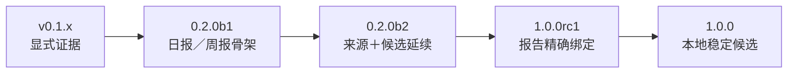

<!-- translation-of: UPDATE_MAP.md sha256:5c530a18a53c242d -->

# 更新地图

Requirement Ledger v1.0.0 是**本地稳定候选**。本地图记录已完成的本地发布列车，并与外部发布分开：
不表示已打 Tag、推送、创建 GitHub Release、获得公开 CI 结果、提交 marketplace 或已有采用。

[English](UPDATE_MAP.md) · [稳定契约](docs/V1_STABLE_CONTRACT.zh-CN.md) ·
[路线图](ROADMAP.zh-CN.md)



## 已完成的本地列车

| 候选版本 | 真实增量 | 本地状态 |
| --- | --- | --- |
| `0.2.0b1` | 已安装 `audit`／`daily`／`weekly` 审查骨架，以及明确时区／窗口处理。 | 已完成并完成本地核验。 |
| `0.2.0b2` | 无路径来源包、明确来源复验，以及不做语义猜测的候选延续。 | 已完成并完成本地核验。 |
| `1.0.0rc1` | 最终报告精确绑定和只读交接复验。 | 已完成并完成本地核验。 |
| `1.0.0` | 稳定契约、核心／插件分层、发布文档和完整本地资格核验。 | 本地稳定候选；外部发布仍是单独动作。 |

早期 v0.1 显式输入命令仍保持兼容。更早的 Alpha 工作建立了有边界的 Codex 输入处理；它不代表可以
自动发现历史，也不会扩大 v1 的来源范围。

## 稳定产品表面

固定的 v1 工作流为：

```text
review-init / review-check
  -> source-pack / source-verify
  -> candidate-sync
  -> final report
  -> review-bind
  -> review-handoff-check
```

`audit`、`daily` 和 `weekly` 都要求宿主／用户选择目标；适用时还需选择窗口、范围根和来源文件。
交接检查成功只表示身份一致：当前报告字节、候选状态和明确来源与绑定相符。它不能证明正确性、批准、
所有权或执行某个动作的权限。

Codex 层是仓库内 `.agents/plugins/marketplace.json` 与 `plugins/requirement-ledger` 的
skills-only 插件。它引导已经安装的 CLI；不包含重复运行时、MCP 服务、app、hooks、插件自有认证
实现／凭据流或更新器。必需的 `ON_INSTALL` marketplace 策略是 Codex 宿主元数据。

## 本地资格与公开发布

稳定候选只有在此 checkout 的本地源码测试、构建／干净安装冒烟、命令工作流、插件结构／安装检查和
文档／契约复核一致时才算通过。本地检查由维护者控制，不能声称已经通过托管 CI 或证明外部使用。

任何公开发布之前，维护者必须单独决定 commit／tag／push、发布资产、复验精确公开产物，并满足当时的
Codex marketplace／提交要求。CLI 不执行这些动作，本文件也不暗示已经执行。

## 未来 `1.x`

- `1.0.x`：只处理有证据支持的兼容性、隐私、解析、打包或文档修复。
- `1.1`：只有在明确输入边界、同意、保留和失败模式，并独立测试后，才考虑 opt-in 集成。
- 更远期：其他 provider 或更高层 UX 只能在保持明确来源选择、私有证据和不授予权限的校验前提下加入。

没有预定的版本凑数。新版本必须有真实、经过测试的改动，并获得单独授权的发布决定。
