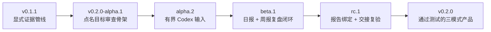

<!-- translation-of: UPDATE_MAP.md sha256:67208bfbfdd83b58 -->

# 更新地图

Requirement Ledger 将用十天、逐门禁的冲刺完善成可用的 `v0.2.0` 产品。天数只是复核目标，不能
作为发布未完成内容的许可。每个公开版本都必须能力完整、测试通过、说明准确，并通过隐私复核。

[English](UPDATE_MAP.md) · [路线图](ROADMAP.zh-CN.md) ·
[v0.2.0-alpha.1 更新说明](docs/release-notes/v0.2.0-alpha.1.zh-CN.md)

## 这个 Alpha 位于哪里

`v0.2.0-alpha.1` 是已发布 v0.1 证据引擎与 Codex-first 产品之间第一个可安装的桥梁。它可以
初始化并机械校验一个私有、点名目标的一次性审查；它本身**不会**读取目标历史，也不会独立做语义诊断。

## 问题到能力的映射

| 用户问题 | Alpha 1 的回应 | 状态 |
| --- | --- | --- |
| “我能点名 Skill 或项目，但不知道审查结构该怎么写。” | `review-init --mode audit` 生成有明确目标、窗口、时区、覆盖与未知项的私有审查骨架。 | Alpha 1 已交付 |
| “报告看着完整，但可能缺少必要证据或安全字段。” | `review-check` 校验报告契约、章节、证据标签、候选状态、授权声明和时间窗口。 | Alpha 1 已交付 |
| “生成审查可能覆盖已有内容，或让私有文件权限过宽。” | 在支持的平台上，新骨架使用严格权限；输出路径已存在时直接失败。 | Alpha 1 已交付 |
| “我希望 Codex 只找相关历史，不要让我重新讲一遍。” | 增加有界 Codex 输入适配器，诚实记录覆盖范围和排除项。 | 下一个 Alpha 门禁 |
| “我想复盘昨天和过去一周，又不想重复旧建议。” | 增加真实日报／周报初始化、稳定候选延续和去重。 | Beta 门禁 |
| “我需要证明最终交接的就是我批准的那份报告。” | 绑定报告精确字节，并在交接前立即复验。 | RC 门禁 |

## 十天完善冲刺

| 目标日 | 候选版或里程碑 | 只有满足这些条件才能退出 |
| --- | --- | --- |
| 第 1 天 | `v0.2.0-alpha.1` | 公开预发布资产可干净安装；点名审查骨架与校验器通过；说明和校验值与上传文件一致。 |
| 第 2 天 | 公开复跑 + 第二个真实 named-Skill 案例 | 维护者点名的案例记录纳入／排除来源、一个保留行为、一张有用改动卡、一个成功案例和一个边界案例。 |
| 第 3 天 | `v0.2.0-alpha.2` 目标 | 有界 Codex 导出输入经过显式选择，不扫描无关历史，诚实标记部分覆盖，并有回归测试。 |
| 第 4 天 | 日报／周报实现门禁 | 昨日／一周窗口、时区、来源、只分析授权均可机械测试。 |
| 第 5 天 | `v0.2.0-beta.1` 目标 | 安装后的包能初始化一次性／日报／周报；候选稳定 ID 能避免重复建议。 |
| 第 6 天 | 报告绑定门禁 | 审查包绑定目标、来源、候选状态和报告精确字节，同时不把私有原文复制到可分享输出。 |
| 第 7 天 | `v0.2.0-rc.1` 目标 | 交给 Codex 前立即复验已批准报告；内容不匹配和过期报告都会失败即停止。 |
| 第 8 天 | 跨平台与隐私加固 | Linux、macOS、Windows CI 通过；wheel/sdist、干净安装、权限、路径安全和隐私 canary 通过。 |
| 第 9 天 | `v0.2.0-rc.2` 目标 | 一次性／日报／周报合成 Demo、维护者自有证据、文档和安装包彼此一致。 |
| 第 10 天 | `v0.2.0` 决策 | 只有同一个 commit 上全部 v0.2 承诺都通过才发布；否则公开失败门禁并继续使用现有预发布版。 |

候选版名称只是目标，不是制造动态的承诺。本计划不包含空版本、回填日期或自动每日发布。

### 发布门禁

每个公开候选版至少必须通过同一组门禁：

1. 全量源码测试和双语文档同步；
2. 从待打 Tag 的源码构建 wheel 与 sdist；
3. 两种产物分别干净安装，并通过命令级冒烟测试；
4. 合成输出确定性一致，隐私与路径检查失败即停止；
5. diff 经人工复核、限制说明准确、校验清单只用相对文件名、公开 CI 通过；
6. 维护者当前明确决定发布这个精确 commit。

## “十天完善”具体指什么

目标是一个稳定、可用的 `v0.2.0`：同一仓库和可安装包支持可追溯的一次性、日报、周报 Codex
复盘工作流；任何修改前都能看到授权，修改后都有可复现的交接证据。它不表示所有未来集成或每一种
个人工作流都已经完成。

## 本次冲刺明确不做

- 无人值守修改、commit、push、Issue、PR、Release、上传或账号动作；
- 静默发现主目录或无关 Codex 历史；
- 托管看板、遥测，或没有证据就声称已有外部用户采用；
- 声称模式隐私检查可以代替真人复核，让报告天然适合公开。
